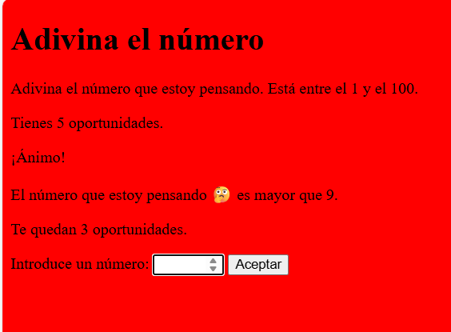
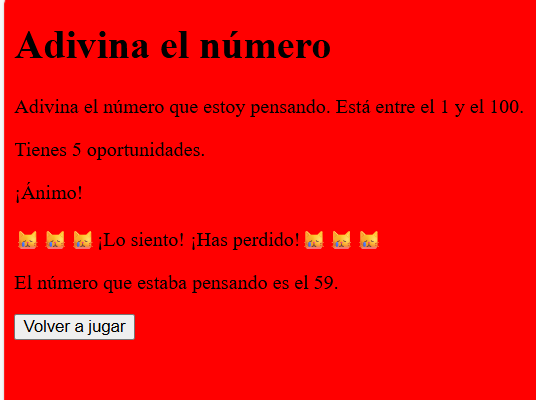

# adivina-el-numero-php

Juego realizado en ***PHP*** en el que el usuario intenta adivinar el número que ha pensado el ordenar. 

Tendrás <ins>5 intento</ins> para averiguar el número.

## Caracteristicas del juego

* REalizado en PHP
* Sigue buenas prácticas
* Programado con cariño :❤️
* Adictivo

Dale una ⭐ a este juego si te ha gustado.
